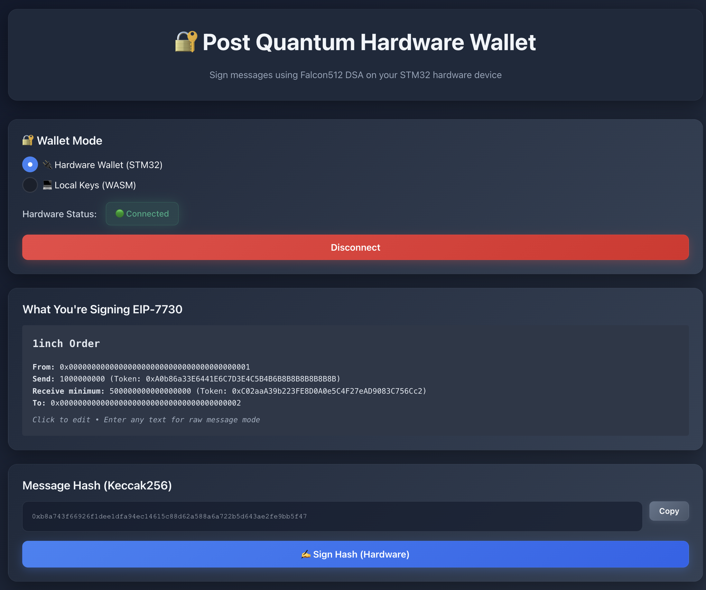
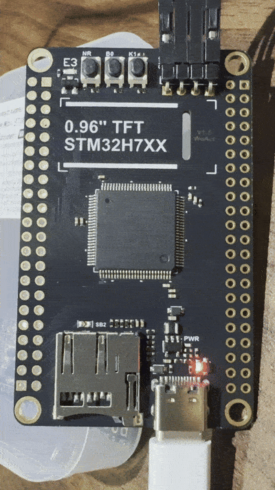

# Falcon512 STM32 Hardware Wallet


**Live Demo**: [https://www.postquantumhardwarewallet.com/](https://www.postquantumhardwarewallet.com/)

A post-quantum hardware wallet implementation using Falcon-512 signatures on STM32 microcontrollers, designed to provide quantum-resistant transaction signing for institutional cryptocurrency custody.

## Abstract 

Institutional capital will not fully commit to blockchains until keys and signatures are provably safe against quantum adversaries. Ethereum's current ECDSA and BLS schemes are dead in a post-quantum world: Shor's algorithm makes the elliptic-curve discrete log problem tractable, so any account that has ever broadcast a signed transaction leaks enough information (signature + message) to reconstruct its public key and, once a large quantum computer exists, recover its private key. Recent roadmaps and expert surveys now treat a cryptographically relevant quantum computer as a medium-term risk in roughly a five-to-ten-year window, with non-trivial probability even near five years for state-level actors. In that world, it is rational for an adversary to spend quantum resources to compromise large Bitcoin and Ethereum accounts while shorting the assets, with plausible damage in the multi-trillion-dollar range. "Harvest-now, exploit-later" collection of signatures is therefore a credible threat to long-lived wallets and institutional treasuries.

Hardware wallets are effectively mandatory for institutions, which require dedicated signing modules, strong key isolation, and auditable controls. Yet devices in mass production today (Ledger, Trezor, and peers) still expose only classical ECC DSAs for user keys; there is no widely deployed hardware wallet that supports NIST-standardized post-quantum signatures for transaction signing. "Quantum-ready" offerings mostly use PQC for firmware attestation and update authenticity, not for the DSAs that actually secure on-chain assets.

Falcon-512 is one of the few lattice-based schemes compact enough to be economically viable on-chain: at level-1–equivalent security it offers ~897-byte public keys and ~666-byte signatures, versus roughly 3–4× larger signatures for Dilithium-2 / ML-DSA-44. Those size differences translate directly into higher calldata costs on Ethereum. Falcon is also the better fit as Ethereum "zk-ifies": beyond smaller signatures, Falcon verification has a lighter arithmetic and hashing footprint in zkVMs. Dilithium's verification uses multiple SHAKE invocations and many polynomial multiplications, whereas Falcon uses a single hash of the message to a polynomial (easy to replace with Poseidon2 or RPO in zk settings) and one polynomial multiplication. Each extra SHAKE call and multiplication is costly to arithmetize, so Falcon is substantially cheaper to verify in a zkVM. zkVM systems such as Miden already use a Falcon-512 variant as their default wallet scheme.

This project delivers a post-quantum hardware wallet based on an STM32 microcontroller and a heavily adapted no_std Rust implementation of Falcon-512. Starting from aszepieniec/falcon-rust, we re-engineered the cryptographic core for embedded constraints, replaced standard math dependencies with libm = "0.2", and refactored memory usage to fit safely within the MCU's SRAM. Rust was chosen over the official C reference (pornin/c-fn-dsa) for stronger safety guarantees, tighter control over undefined behavior, and a clearer path toward formal verification. The result is a forward-compatible signing device capable of generating compact, quantum-resistant Falcon-512 signatures today, giving institutions and security-sensitive individuals a realistic way to harden key custody ahead of the quantum transition.

## How It's Made

The prototype is implemented entirely in Rust, from cryptographic core to embedded firmware and host tooling. I began by forking an existing Falcon-512 Rust implementation (aszepieniec/falcon-rust) and converting it to no_std, replacing std dependencies and floating-point/math calls with core and libm = "0.2", and then aggressively optimizing memory usage (explicit scratch buffers, reduced copies, flattened call paths) to fit comfortably within the SRAM constraints of an STM32 microcontroller. This no_std Falcon-512 library is compiled into a bare-metal STM32 firmware that exposes a minimal message-based protocol over the wire: the host sends messages (or hashes), the device returns Falcon-512 signatures, and the private key never leaves the microcontroller. In this hackathon version, on-device key generation and any secure element integration are explicitly out of scope, keys are provisioned externally, and the device is intended as a feasibility demonstration that Falcon signing on a microcontroller is straightforward in practice. On the host side, a Rust frontend handles user interaction, talks to the STM32 over a simple framed transport, and verifies signatures using a WebAssembly module that reuses the same Falcon verifier code compiled to WASM, yielding a single coherent Rust codebase for embedded signing, host orchestration, and client-side verification.

## Demo

**Live Demo**: [https://www.postquantumhardwarewallet.com/](https://www.postquantumhardwarewallet.com/)



The following demonstration shows the complete signing workflow:

### Step 1: Initiating Signature Request


### Step 2: Waiting for user button confirmation


**Complete Workflow:**

1. **User initiates signing**: Click "Sign" button in the web UI
   - STM32 enters signing mode with slow blinking LED
   
2. **Waitingfor user confirmation**: Press the physical button on the STM32
   - LED switches to fast blinking, indicating signature generation in progress
   
3. **Signature generation**: STM32 computes Falcon-512 signature
   - LED becomes solid while performing cryptographic operations
   
4. **Verification**: Web UI receives signature and verifies it
   - Signature verification happens in WebAssembly using the same Falcon implementation


## Crates

### falcon-rust

A fully-featured, no-std implementation of the Falcon post-quantum digital signature scheme. This crate provides:

- Falcon512 (108-bit quantum security)
- Falcon1024 (252-bit quantum security)
- Key generation, signing, and verification
- Serialization/deserialization
- No heap allocations required
- Optimized for embedded constraints

### falcon-wasm

WebAssembly bindings for Falcon-512 verification in the browser:

- Compiles the same Falcon implementation to WASM
- Enables client-side signature verification
- Consistent cryptographic implementation across embedded and web

### frontend

React-based web interface for interacting with the hardware wallet:

- USB communication with STM32 device
- Message composition and signing interface
- Real-time signature verification
- ERC-7730 structured data support

### keygen

Laptop tool for generating Falcon512 key pairs:

- Generates cryptographically secure key pairs
- Outputs keys as Rust arrays and binary files
- Uses ChaCha20 RNG (configurable to OS RNG)
- Designed for one-time key generation per device

### stm32

STM32 firmware that uses pre-generated Falcon512 keys for signing:

- USB communication protocol
- Physical button for user confirmation
- LED status indicators
- Secure key storage in flash
- Hardware RNG support

### usb-client

Command-line client for communicating with the STM32 device:

- Direct USB communication
- Testing and debugging interface
- Batch signing operations

## Quick Start

Without an STM32 it will be hard to test the frontend, but you can try out the flow by generating keys in the browser. Try it out here: [https://www.postquantumhardwarewallet.com/](https://www.postquantumhardwarewallet.com/)

```bash
cargo test --release
```

### Prerequisites

```bash
# Install Rust
curl --proto '=https' --tlsv1.2 -sSf https://sh.rustup.rs | sh

# Add ARM target
rustup target add thumbv7em-none-eabihf

# Install probe-rs for flashing/debugging
cargo install probe-rs --features cli

# Install wasm-pack for WebAssembly builds
curl https://rustwasm.github.io/wasm-pack/installer/init.sh -sSf | sh
```

### Build and Flash Firmware

```bash
# 1. Generate keys
cd keygen
cargo run --release
# Creates: secret_key.bin, public_key.bin

# 2. Build and flash STM32 firmware
cd ../stm32
cargo build --release
probe-rs run --chip STM32H743ZITx target/thumbv7em-none-eabihf/release/stm32
```

### Build Web Interface

```bash
# 1. Build WebAssembly module
cd falcon-wasm
wasm-pack build --target web

# 2. Build and run frontend
cd ../frontend
npm install
npm run dev
```

## Hardware Requirements

- **STM32 MCU**: H7 series recommended (F4 minimum)
- **Flash**: 512 KB+
- **RAM**: 256 KB+ (128 KB minimum)
- **USB**: Native USB support
- **Debug Probe**: ST-LINK, J-Link, or compatible

## Memory Considerations

Falcon512 operations require significant resources:

- **Stack**: 32-64 KB during signing
- **Keys**: ~2.2 KB total (secret + public)
- **Signature**: ~666 bytes
- **Code size**: 300-600 KB depending on optimization

Choose STM32 chips with adequate memory (H7 series recommended).

## Performance Notes

- Build with `--release` for production use
- Enable FPU support (`thumbv7em-none-eabihf` target)
- LTO is enabled for size optimization
- Signing takes < 1 second on STM32H7 @ 400 MHz

## Security Features

- **Quantum-resistant signatures**: Falcon-512 provides 108-bit quantum security
- **Hardware isolation**: Private keys never leave the microcontroller
- **User confirmation**: Physical button press required for signing

## License

MIT License - see individual crate directories for details.

## Resources

- [Falcon Signature Scheme](https://falcon-sign.info/)
- [NIST PQC Project](https://csrc.nist.gov/projects/post-quantum-cryptography)

## Future Work

- Hardware security module integration
- Secure element support (ATECC608, etc.)
- Side-channel attack mitigation
- User defined RNG on STM32
- On STM32 key generation